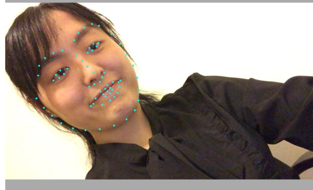

# Face Landmarking on iOS device

This prototype shows basic face landmark recognition on a ```CMSampleBuffer``` (see ```DlibWrapper.mm```) coming out of an ```AVCaptureSession```.

Through Profiling->Animation, frame rate is actually around 30 fps since we are using the system face detection via ```AVCaptureMetadataOutput```.

The maximum frame rate available for current device can be 60 fps. However, when the core part of facial landmark is running, frame rate can only be 9-10 fps, which means that we may need to modify the implementation of facial landmark in DlibWrapper.mm to speed up.

## Screenshot



## Credits

This app uses the Dlib library (<http://dlib.net>) and their default face landmarking model file downloaded from <http://dlib.net/files/shape_predictor_68_face_landmarks.dat.bz2>. Thanks for the great work.

This project includes a precompiled Dlib. If you want to change something, consider that the ```Preprocessor Macros``` in the project linking Dlib need to be the same as the ```Compiler Flags``` when building the lib.

The project to build Dlib on iOS was generated according to [these](http://stackoverflow.com/a/35058969/972993) instructions. 

Thanks to Satya Mallick from [learnopencv.com](http://www.learnopencv.com). He recommended using the system face detector to me.

To many thanks to RASS. Check out his(her) instructions on how to generate new [libdlib.a](https://github.com/RedHandTech/Object_Detector) !!!

## License

Code (except for ```DisplayLiveSamples/lib/*```) is released under MIT license.

Code ("configurecamera") is created based on Apple Developer Documentation and adapted by us.
